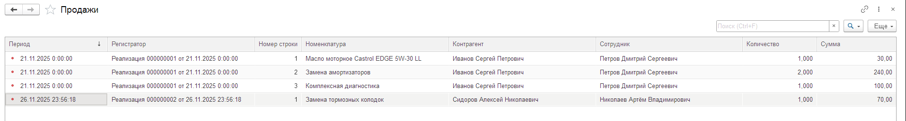
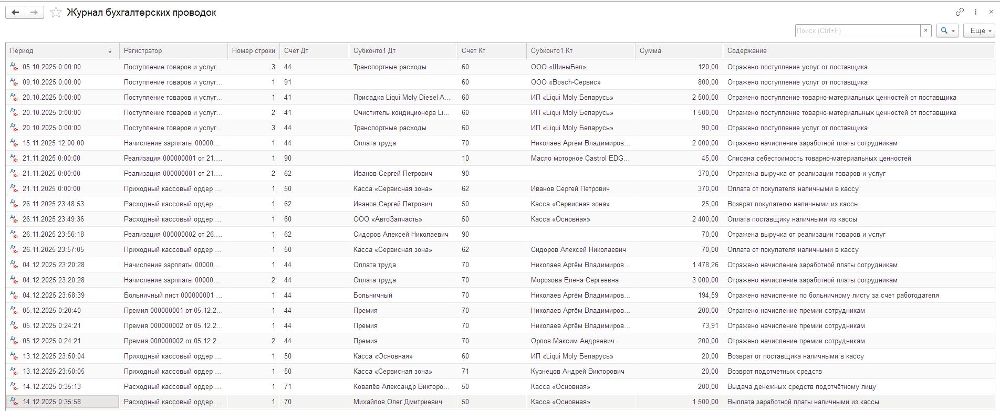
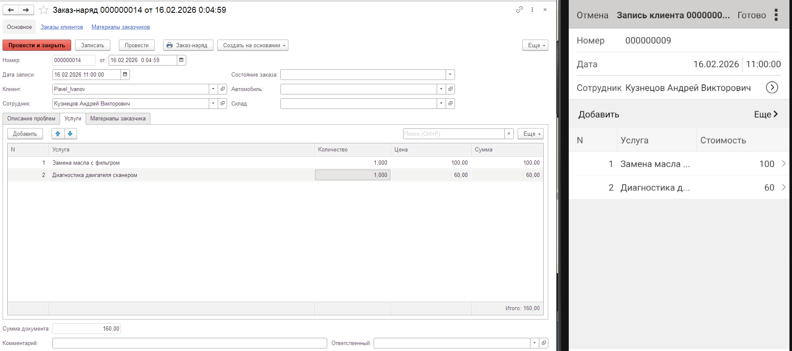

# Автосервис

Полноценная клиент-серверная система для автоматизации работы автосервиса.

Проект реализован на 1С:Предприятие 8.3 (управляемые формы) с разделением на:

🖥 Основную конфигурацию (учёт, склад, финансы, зарплата)

📱 Мобильное приложение (запись клиентов через HTTP-сервисы)

Архитектура: клиент-серверная модель, использование регистров накопления и бухгалтерии, проведение документов с контролем остатков.

## ⚙ Основной функционал

Учёт клиентов и автомобилей

Формирование заказ-нарядов

Учёт товаров и услуг

Контроль складских остатков

Проведение реализаций товаров и услуг

Учёт денежных средств

Начисление заработной платы сотрудникам

Формирование бухгалтерских проводок

Отчётность

Интеграция с мобильным приложением через HTTP-сервисы

## 🏗 Архитектура

Управляемые формы

Клиент-серверный режим работы

HTTP-сервисы для интеграции

Разделение основной и мобильной конфигурации

## 📸 Скриншоты
1. Документ «Заказ-наряд»

Управляемая форма с табличной частью товаров и услуг.
При проведении формируются движения по регистрам.


2. Список заказ-нарядов

Интерфейс работы пользователя с документами.


3. Движения по регистру накопления «Товары на складах»

Отражение приходов и расходов товаров для последующего получения остатков и оборотов товаров.


4. Движения по регистру «Продажи»

Фиксация продаж по номенклатуре и клиенту на основании документа «Реализация».



5. Бухгалтерские проводки

Журнал бухгалтерских проводок — отражение хозяйственных операций, сформированных документами системы.



6. Отчёт «Оборотно-сальдовая ведомость» (счет 62)

Анализ взаиморасчетов с покупателями с отображением оборотов и начального/конечного сальдо по контрагентам.


7. Интеграция мобильного приложения

Создание записи клиента в мобильном приложении с автоматическим созданием документа "Заказ-наряд" в основной базе через HTTP-сервис.



## 🚀Инструкция по развёртыванию.

### Развёртывание основной конфигурации

Создать новую информационную базу 1С
(рекомендуется клиент-серверный режим, допускается файловый).

Открыть базу в режиме Конфигуратор.

Загрузить конфигурацию:

```
Конфигурация → Загрузить конфигурацию из файла
```

Выбрать файл:
```
autoservice.cf
```

Обновить конфигурацию базы данных (F7).

Запустить базу в режиме Предприятие.

### Публикация HTTP-сервисов (для мобильного приложения)

Опубликовать базу на веб-сервере (IIS или Apache).

Убедиться в доступности HTTP-сервисов:
```
users

registration

customerOrders
```

### Развёртывание мобильной конфигурации

Создать мобильную информационную базу.

В режиме Конфигуратор загрузить:

```
mobile.cf
```

Указать URL опубликованной основной базы.

Запустить приложение и выполнить авторизацию/регистрацию.
